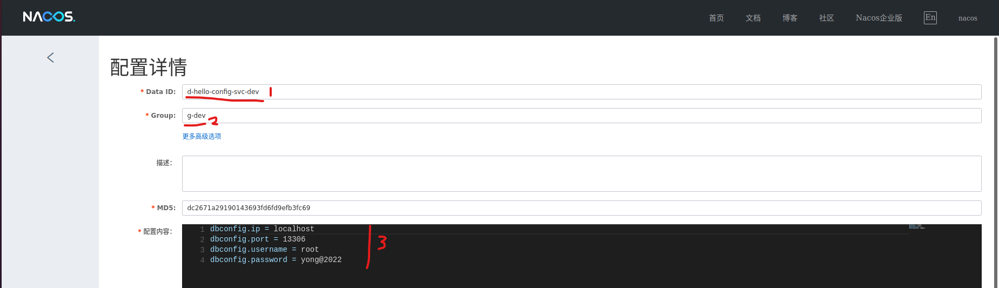

# 创建数据库，并初始化数据

~~~jshelllanguage
docker run --name yong-mysql -d -e MYSQL_ROOT_PASSWORD=yong@2022 -p13306:3306 mysql
~~~

建表

~~~sql
use hellotest;
drop table if exists customer;

create table customer
(
  id       bigint,
  username varchar(40),
  name     varchar(20),
  age      int(3),
  balance  decimal(10, 2),
  primary key (id)
);
~~~

数据
~~~sql
INSERT INTO hellotest.customer (id, username, name, age, balance) VALUES (1, 'aaa', 'aaa', 12, 2.50);
INSERT INTO hellotest.customer (id, username, name, age, balance) VALUES (2, 'bbb', 'bbb', 13, 2.30);
~~~

# 创建配置

创建命名空间

在命名空间下创建配置

配置如下：

应用程序在找配置的时候，需要四个匹配：

1. 命名空间匹配（写在配置文件中）
2. dataid匹配（写在Application注解里面）
3. group匹配（写在Application注解里面）
4. 类型匹配（应用程序默认加载Properties类型的配置）

# 对应的应用程序配置

由于nacos默认加载的是bootstrap配置，优于application配置加载，所以在application配置里面可以直接使用nacos里面的配置数据

# 效果

